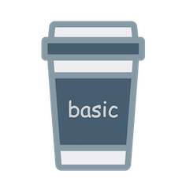

# Basic
 


[](https://kotlinlang.org)

A Kotlin Multiplatform library to rapidly add basic features like pictures, logging, and audio to any project in a small and fast way.

| Platforms     |        Ads         |          Images          |      Logging       |          Sound           |
|:--------------|:------------------:|:------------------------:|:------------------:|:------------------------:|
| Android       | :white_check_mark: |    :white_check_mark:    | :white_check_mark: |    :white_check_mark:    |
| iOS           | :white_check_mark: |    :white_check_mark:    | :white_check_mark: |    :white_check_mark:    |
| macOS         |  :no_entry_sign:   |    :white_check_mark:    | :white_check_mark: |    :white_check_mark:    |
| watchOS       |  :no_entry_sign:   |     :no_entry_sign:      | :white_check_mark: |    :white_check_mark:    | 
| tvOS          |  :no_entry_sign:   | :hourglass_flowing_sand: | :white_check_mark: |    :white_check_mark:    | 
| nodeJS        |  :no_entry_sign:   | :hourglass_flowing_sand: | :white_check_mark: |    :white_check_mark:    | 
| jsBrowser     |  :no_entry_sign:   | :hourglass_flowing_sand: | :white_check_mark: |    :white_check_mark:    |
| wasmJsBrowser |  :no_entry_sign:   | :hourglass_flowing_sand: | :white_check_mark: |    :white_check_mark:    |
| JVM           |  :no_entry_sign:   |    :white_check_mark:    | :white_check_mark: | :hourglass_flowing_sand: |
| Linux         |  :no_entry_sign:   | :hourglass_flowing_sand: | :white_check_mark: | :hourglass_flowing_sand: |
| Windows       |  :no_entry_sign:   | :hourglass_flowing_sand: | :white_check_mark: | :hourglass_flowing_sand: |

## Documentation
* [Basic-Ads](basic-ads/README.md) [](https://central.sonatype.com/artifact/app.lexilabs.basic/basic-ads)
* [Basic-Images](basic-images/README.md) [](https://central.sonatype.com/artifact/app.lexilabs.basic/basic-images)
* [Basic-Logging](basic-logging/README.md) [](https://central.sonatype.com/artifact/app.lexilabs.basic/basic-logging)
* [Basic-Sound](basic-sound/README.md) [](https://central.sonatype.com/artifact/app.lexilabs.basic/basic-sound)

## Quick Start
Add your dependencies from Maven
```toml
# in your 'gradle/libs.versions.toml' file
[versions]
lexilabs-basic = "+" # gets the latest version

[libraries]
lexilabs-basic-ads = { group = "app.lexilabs.basic", name = "basic-ads", version.ref = "lexilabs-basic" }
lexilabs-basic-images = { group = "app.lexilabs.basic", name = "basic-images", version.ref = "lexilabs-basic" }
lexilabs-basic-logging = { group = "app.lexilabs.basic", name = "basic-logging", version.ref = "lexilabs-basic" }
lexilabs-basic-sound = { group = "app.lexilabs.basic", name = "basic-sound", version.ref = "lexilabs-basic" }
```
then include the library in your gradle build
```kotlin
// in your 'shared/build.gradle.kts' or 'composeApp/build.gradle.kts' file
sourceSets {
    commonMain.dependencies {
        implementation(libs.lexilabs.basic.images)
        implementation(libs.lexilabs.basic.logging)
        implementation(libs.lexilabs.basic.sound)
        implementation(libs.lexilabs.basic.ads)
    }
}
```